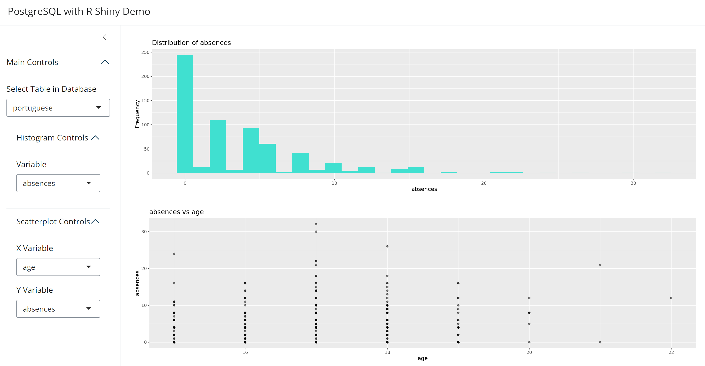

# R Shiny App Connected to PostgreSQL Database

Interactive R Shiny dashboard, connected to PostgreSQL database.

To use the app, fill in the database parameters with the parameters from your PostgreSQL database. 

NOTE: The data used in this app is not present in this repository, to obtain the data, go to this [link](https://archive.ics.uci.edu/dataset/320/student+performance), download and unzip the data folder. 

