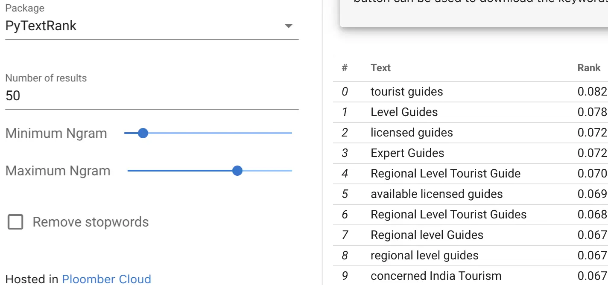

# Keyword Extraction Solara App

This Solara app is designed for performing keyword extraction from text documents. 

Currently, it supports the packages `PyTextRank` and `Yake` for extracting the most relevant keywords from the input text. 
The extracted keywords can be useful for content analysis, search engine optimization (SEO), and other natural language processing tasks.

## Getting Started

To get started with this Solara app, follow these steps:

1. Login to your [Ploomber Cloud](https://ploomber.io/) account.

2. Follow the [steps](https://docs.cloud.ploomber.io/en/latest/apps/solara.html) for deploying a Solara application and upload the `app.zip` file provided in the example.

## How to use

1. **Dataset**: Click the `SAMPLE DATASET` button to load a sample text file, or upload your own content by dragging a file to the drop area. You may also clear the loaded data by clicking the `Clear Dataset` button.

2. **Packages** Currently two packages are supported: [PyTextRank](https://github.com/DerwenAI/pytextrank) and [Yake](https://github.com/LIAAD/yake). Select the package you want for extracting keywords.

3. **Number of results**: Input the desired number of keywords to be extracted. Default is 50. The output will automatically refresh.

4. **NGram range**: N-grams are contiguous sequences of N tokens (words) extracted from a text. Select the number of tokens in extracted keywords using the `Minimum NGram` and `Maximum NGram` sliders.

5. **Remove Stopwords**: Stopwords are commonly used words (such as "the," "and," "in," etc.) in a language that are often filtered out or excluded from text processing and analysis because they are so frequent and provide little information or value when examining the meaning or patterns in a text. To remove stopwords before performing keyword extraction process tick the `Remove stopwords` checkbox.

6. **Download keywords**: Extracted keywords can be downloaded in `.csv` format.