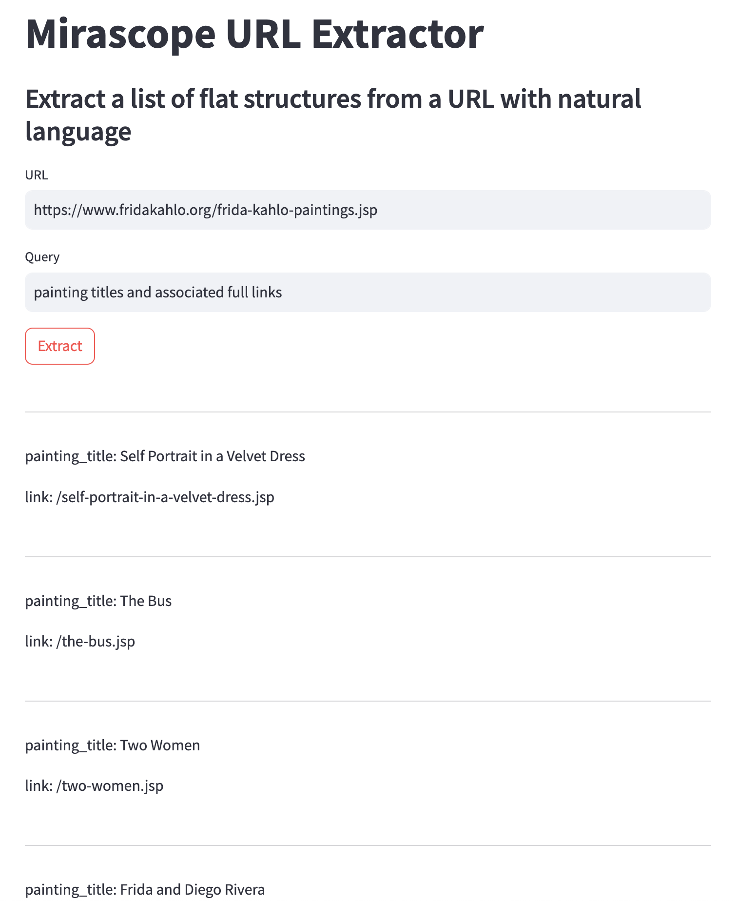

# Extracting Structured Data from Websites with Mirascope, Anthropic, and Streamlit

## Introduction

Extracting structured data from websites can be a tedious and time-consuming task. Often, the information we need is buried in unstructured HTML pages, requiring us to write custom scrapers or rely on brittle XPath selectors. But what if we could simply describe the data we want in plain English and have an AI-powered tool extract it for us?

That's exactly what the [Mirascope URL Extractor](https://github.com/ploomber/doc/tree/main/examples/streamlit/mirascope-url-extractor) achieves. By leveraging the [Mirascope library](https://github.com/Mirascope/mirascope/tree/v0.3.0), Anthropic's natural language models, and the Streamlit framework, it allows users to extract structured data from webpages using simple natural language queries. Let's walk through how it works step-by-step.

## Dynamically Generating Field Definitions with Mirascope

At the core of the app are the FieldDefinition and SchemaGenerator classes. FieldDefinition is a Pydantic model that defines the name and type of each field we want to extract:

```python
class FieldDefinition(BaseModel):
    name: str = Field(..., description="The desired name for this field.")
    type: Literal["str", "int", "float", "bool"]
```

The SchemaGenerator class is a Mirascope AnthropicExtractor that takes a natural language query and generates a list of FieldDefinitions based on it:

```python
class SchemaGenerator(AnthropicExtractor[list[FieldDefinition]]):
    api_key = settings.anthropic_api_key
    extract_schema: Type[list] = list[FieldDefinition]
    prompt_template = """
    Call your tool with field definitions based on this query:
    {query}
    """
    query: str
```

The prompt_template provides instructions to the underlying language model, while extract_schema specifies the expected return type. When called, the SchemaGenerator prompts the Anthropic model to generate field definitions matching the given query.

## Creating a Pydantic Model on the Fly

With the field definitions in hand, the next step is to dynamically create a Pydantic model representing the schema. This is handled in the WebpageURLExtractor.generate_schema() method:

```python
def generate_schema(self) -> None:
    field_definitions = SchemaGenerator(query=self.query).extract()
    model = create_model(
        "ExtractedFields",
        __doc__=DEFAULT_TOOL_DOCSTRING,
        **{
            field.name.replace(" ", "_"): (field.type, ...)
            for field in field_definitions
        },
    )
    self.extract_schema = list[model]
```

Here, we first call the SchemaGenerator to get the field definitions for our query. We then use Pydantic's create_model() function to generate a new model class named ExtractedFields, with fields corresponding to the names and types in the definitions. Finally, we update the extract_schema to expect a list of this new model.

Using Pydantic for the generated schema gives us automatic type validation and serialization for the extracted data downstream.

## Extracting Webpage Text with BeautifulSoup

To feed webpage content to Mirascope for extraction, we use the popular BeautifulSoup library. The WebpageURLExtractor.webpage_content property fetches the HTML content at the given URL, parses it with BeautifulSoup, and extracts the visible text and link URLs:

```python
@computed_field
@property
def webpage_content(self) -> str:
    request = Request(url=self.url, headers={"User-Agent": "Mozilla/6.0"})
    html_doc = urlopen(request).read().decode("utf-8") 
    soup = BeautifulSoup(html_doc, "html.parser")
    
    text = soup.get_text()
    for link in soup.find_all("a"):
        text += f"\n{link.get('href')}"
        
    return text
```

The resulting webpage_content string contains all the text visible on the page, along with any hyperlink URLs, which is then passed to Mirascope for extraction.

## Extracting Structured Data with the Generated Schema

The WebpageURLExtractor class brings it all together. As an AnthropicExtractor, it takes a url and query, and returns structured data conforming to the generated schema:

```python
class WebpageURLExtractor(AnthropicExtractor[BaseModel]):
    api_key = settings.anthropic_api_key
    extract_schema: Type[BaseModel] = BaseModel
    prompt_template = """
    YOU MUST USE THE PROVIDED TOOL FUNCTION.
    Call the function with parameters extracted from the following content:
    {webpage_content}
    """
    url: str
    query: str
    call_params = AnthropicCallParams(max_tokens=4000)
```

When we create the `WebpageURLExtractor` instance, we first call `.generate_schema()` to create the schema based on the query. We then use this schema when we call `.extract()` call to extract data from the webpage_content. The `call_params` allow us to configure key parameters like max_tokens.

To handle potential errors and timeouts, the we run the extraction with `retries=3`:

```python
extractor = WebpageURLExtractor(url=url, query=query)
try:
    extractor.generate_schema()
    st.session_state.extracted_items = extractor.extract(retries=3)
except Exception as e:
    status.error(f"Error: {e}")
```

This automatically retries the extraction up to 3 times if issues are encountered.

## Building the Streamlit UI

To make the extractor easily accessible, the app uses the Streamlit library to build a simple web interface. The key elements include:

- Text inputs for the webpage URL and natural language query
- An 'Extract' button to trigger the extraction process
- A status indicator to display progress and errors
- A results section showing the extracted data
- Here's what the interface looks like:



Streamlit makes it a breeze to bind Python code to interactive UI elements, allowing users to input their desired URL and query, kick off the extraction, and view the structured results.

## Deploying on Ploomber Cloud

To make the Mirascope URL Extractor publicly available and easily accessible, we deployed it on Ploomber Cloud - a managed platform for building and hosting Streamlit apps.

You can try out the live app here: [Insert link to your Ploomber Cloud app]

Ploomber Cloud handles the infrastructure and deployment, so we can focus on the app code. It also allows colleagues and other users to access and use the extractor without needing to run any code locally.

## Conclusion

By combining the Mirascope library, Anthropic's powerful language models, and the Streamlit framework, we've built an app that can extract structured data from webpages using only natural language queries. Pydantic and BeautifulSoup provide key assists for data validation and HTML parsing.

Whether you need to scrape product details, extract article metadata, or parse recipe ingredients, the Mirascope URL Extractor provides a flexible and user-friendly solution. Give the demo a try and check out the code to see how you can adapt it for your own website extraction needs.

This is just one example of the powerful applications made possible by Mirascope and Anthropic. To learn more about what you can build with natural language instructions and LLMs, check out the Mirascope documentation and Anthropic's site.

Happy data extracting!
