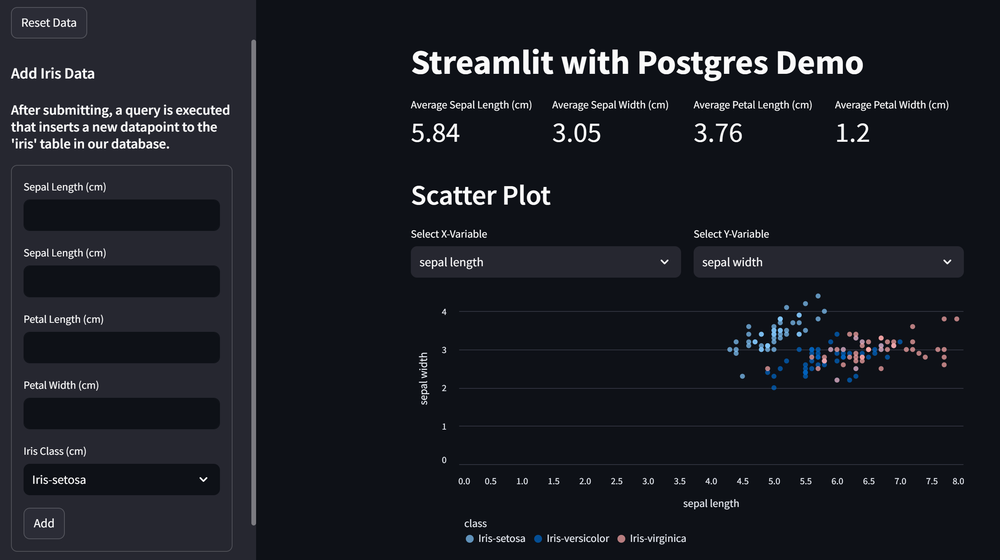

# Streamlit App Connected to Postgres
To showcase the power of using a database with Streamlit apps to display live data, this app enables users to insert their own data into a table on their database. The new data is then automatically displayed and used in the app. 



## Running the App
In app.py, you will find this line of code. If you are deploying on the Ploomber cloud, set this to True. 

```Python
cloud = False 
```

To run this app locally ensure you replace `YOUR_URI` in 
```Python 
DB_URI = environ["DB_URI"] if cloud else "YOUR_URI"
``` 
to your personal database URI and that you have installed all the packages listed in requirements.txt. Then, execute `streamlit run app.py` in your command line. 

## Deployment
When deploying this app on Ploomber Cloud you need to set the `DB_URI` as a secret. Refer to the [documentation](https://docs.cloud.ploomber.io/en/latest/user-guide/secrets.html) to learn more. 